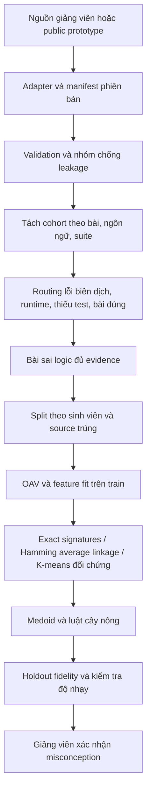

# Đề tài 5 — nghiên cứu và pipeline thử nghiệm ban đầu

> Cập nhật cùng ngày 19/09/2026: đã triển khai ITSP công khai, schema v2 cho ID chưa biết và
> extractor cú pháp C. Xem [nhật ký thực hiện](itsp_progress.md), [kết quả](../results/itsp/summary.md)
> và [verification](verification.md). Các phần nói về fixture/Python trong kế hoạch ban đầu dưới đây
> mô tả mốc trước ITSP; dữ liệu chính thức của giảng viên vẫn chưa được cung cấp.

Ngày chốt khảo sát: **19/09/2026**. Chưa có dataset chính thức. Những con số về thí nghiệm đi kèm là kiểm tra phần mềm trên fixture tổng hợp; không đại diện sinh viên, môn học hoặc ngôn ngữ mà giảng viên sẽ cung cấp.

## 1. Phát biểu bài toán khả thi

Đầu vào lý tưởng là source của các lần nộp, đề bài, test suite và kết quả từng test, ID sinh viên ẩn danh, phiên bản môi trường và thời gian nộp. Hệ thống tìm những nhóm bài có biểu hiện lỗi gần nhau, đưa ví dụ đại diện và luật mô tả cho giảng viên. Giảng viên xác nhận/đổi tên/tách/gộp nhóm và quyết định cần giảng lại khái niệm nào.

Đơn vị phân cụm ban đầu là **submission**. Đơn vị diễn giải sư phạm là **người học với bằng chứng qua nhiều bài/lần nộp**. Phân biệt lỗi logic quan sát được, cách cài đặt khác nhau, hiểu sai đặc tả và niềm tin sai về ngôn ngữ. Những đối tượng này không có quan hệ một–một. Một submission có thể biểu hiện nhiều lỗi; một misconception có nhiều biểu hiện.

Ví dụ hoán vị cần sửa thuật ngữ: trong C, tham số kể cả con trỏ vẫn truyền theo giá trị; thay đổi qua địa chỉ có thể đổi dữ liệu bên gọi. Luật hợp lý ban đầu là “tham số không cho phép cập nhật dữ liệu bên gọi + test quan sát bên gọi không thay đổi → ứng viên cần kiểm tra hiểu biết về tham số/địa chỉ”. Không dùng câu “chưa hiểu truyền tham chiếu” như kết luận chắc chắn, và không áp cùng luật cho Python hay C++.

**Câu hỏi nghiên cứu:**

1. Kết hợp outcome và cấu trúc có giúp giảng viên tìm nhóm lỗi có ích hơn chỉ nhóm cùng test fail không?
2. Bao nhiêu test chẩn đoán cần thiết để phân biệt các cơ chế lỗi khác nhau với chi phí nhỏ?
3. Luật ngắn có mô tả cụm ổn định, đủ coverage, giúp giảm số bài giảng viên phải đọc không?

Không đặt mục tiêu ban đầu là thắng một leaderboard. Giá trị đề tài nằm ở evidence rõ, đánh giá giáo dục đúng và khả năng thay dataset.

## 2. Tổng hợp bằng chứng và lựa chọn

McMining EACL 2026 gần trực tiếp nhất với suy luận misconception nhưng benchmark có thành phần tạo bằng McInject và cách đánh giá phụ thuộc judge. EDM 2025 cho thấy AST có ích để tìm dấu hiệu lỗi, nhưng mô hình của họ có giám sát correctness. Brown 2024 nhấn mạnh test chẩn đoán và conceptual mutants. CodeInsight 2026 có kết quả từng test nhưng cần xin quyền. Các nguồn không chứng minh một thuật toán clustering nào tự động khôi phục niềm tin của sinh viên. Xem [khảo sát nguồn với link và giới hạn](research_sources.md).

Chọn scikit-learn, NumPy và AST chuẩn Python cho bản CPU. Không cần LangChain, vector DB, dịch vụ phân tán, fine-tuning hay GPU. Chỉ cân nhắc embedding pretrained, mô hình AST/graph hoặc LLM sau khi baseline không phân biệt được các nhóm mà chuyên gia xác nhận và đã đo được chi phí/lợi ích. LLM có thể hỗ trợ đề xuất tên cho cụm đã có evidence; không làm oracle hoặc tự gán ground truth.

## 3. Pipeline

Routing và split là bước kiểm soát evidence, không phải classification misconception. Bài đúng giữ trong nguồn làm đối chứng nhưng chưa dùng để train cây “misconception”; sai cú pháp/runtime báo riêng. Phiên bản hiện tại yêu cầu đủ outcome pass/fail để vào cohort logic; chấp nhận giảm coverage để giữ giải thích đơn giản. Khi data thật thiếu nhiều test, nghiên cứu overlap-aware distance hoặc nhóm theo coverage là thí nghiệm riêng; không lặng lẽ impute pass/fail.

**Trước khi có data:** fixture được tạo từ ba công thức lỗi cho bài tổng từ 0 đến n, 16 biến thể mỗi công thức, thêm bốn trường hợp routing. Chỉ code fixture do tác giả viết được dùng để sinh outcome bằng công thức tương ứng; pipeline không thực thi source đầu vào. Không có bài của giảng viên trong dữ liệu này.

**Sau khi có data:** adapter ánh xạ nguồn vào contract; có outcome thì giữ lõi, không có outcome thì xin log hoặc xây runner/test suite được giảng viên duyệt. Chọn extractor theo ngôn ngữ. Không cần viết lại toàn hệ thống; cũng không hứa extractor Python hiểu được con trỏ C.

## 4. OAV và feature engineering

Object `submission_id`; thuộc tính `test:<test_id>` có giá trị categorical; cấu trúc gồm sự hiện diện của for/while/range, toán tử so sánh <= hoặc >=, subscript, return, augmented assignment. Các flag là quan sát tĩnh, không phải lỗi. Tên biến, danh tính, điểm tổng, nhãn chuyên gia và tên lỗi fixture không vào vector. Test suite do người ra đề cung cấp là schema ngoại sinh; fit feature chỉ dựa trên train.

Khoảng cách:

`d(x,y) = Σ w_j 1[x_j ≠ y_j] / Σ w_j`.

Bản mặc định dành tổng trọng số 0,8 cho tests, 0,2 cho các AST flag biến thiên trên train. Nếu không có AST hữu dụng, toàn bộ trọng số chuyển cho tests. Đây là **cấu hình khởi đầu để thí nghiệm**, không phải trọng số đã được chứng minh tối ưu. Chưa hỗ trợ trọng số riêng từng khái niệm/test; khi test gần trùng nhau cần nhóm theo phân vùng input hoặc kiểm tra sensitivity để tránh đếm lặp.

OAV cần tiến đến dữ liệu chẩn đoán: test rỗng, một phần tử, biên cuối, trùng lặp, số âm, alias/mutation… tùy đặc tả bài. Không thêm test ngoài domain; ví dụ n âm không hợp lệ trong fixture hiện tại. Oracle và chính sách so sánh stdout phải cố định; không tự strip toàn bộ khoảng trắng nếu yêu cầu bài phân biệt whitespace.

## 5. Thuật toán và luật

| Thành phần | Chọn ban đầu | Vì sao / giới hạn |
|---|---|---|
| Baseline 0 | Cùng vector outcome → cùng nhóm | Dễ kiểm tra, rẻ; không phân biệt hai cơ chế lỗi có cùng behavior |
| Baseline chính | Average-linkage, distance matrix weighted Hamming | Hợp categorical, không cần embedding; O(n²) bộ nhớ, cần thử số cụm |
| Đối chứng yêu cầu đề tài | K-means trên one-hot có trọng số | Dùng đúng Euclidean centroid objective; không gọi là K-means Hamming |
| Đại diện | Medoid thực trong mỗi cụm | Giảng viên đọc được chương trình thật; thêm mẫu biên/phản ví dụ khi khảo sát |
| Sinh luật | Decision tree sâu tối đa 3, min leaf 2 | Dễ kiểm tra, xuất đường đi thành IF–THEN; là surrogate của cụm |

One-hot đầy đủ cho mỗi thuộc tính được nhân `sqrt(w_j/2)`. Với tổng trọng số bằng 1, squared Euclidean giữa hai quan sát bằng weighted Hamming. Tuy vậy centroid K-means không phải quan sát và objective vẫn khác average linkage. Dùng silhouette theo weighted Hamming làm thước so sánh chung; artifact ghi rõ không phải silhouette theo native Euclidean của K-means.

ILA gốc là quy nạp luật từ dữ liệu có lớp. Chưa triển khai “ILA cải tiến” vì chưa có bản đặc tả cải tiến và cây nông đã đáp ứng nhu cầu kiểm tra ban đầu. Nếu giảng viên yêu cầu ILA: đặt sau bước clustering hoặc sau expert labels, định nghĩa điều kiện chọn conjunction, xử lý conflict/noise, pruning và default/uncovered; đối chiếu với tree/RIPPER. Không đổi tên heuristic thành ILA.

Luật hiện tại có dạng `IF test:t=fail AND ast:range=1 THEN cluster_2`, kèm số mẫu và precision trên từng split. Đây là **fidelity đối với phân vùng**, không phải precision phát hiện misconception. Holdout được gán bằng medoid train đã đóng băng; với mọi thuật toán đây là một chính sách gán thêm, không phải hàm predict gốc của agglomerative hay nearest-centroid K-means. Khoảng cách và số tie được xuất. Chưa có ngưỡng OOD đã hiệu chỉnh, nên chỉ dùng khám phá offline, chưa gửi phản hồi tự động cho sinh viên.

## 6. Thiết kế thí nghiệm sau khi nhận dữ liệu thật

**Giai đoạn A — audit dữ liệu (1–3 ngày làm việc đề xuất):** chọn 1–3 bài cùng chủ đề, kiểm tra missingness, reference, test coverage, phân bố số lần nộp, quyền sử dụng và ID. Bắt đầu 100–500 bài sai nếu có; không coi đây là yêu cầu dữ liệu chắc chắn sẽ nhận được. Nếu thiếu ID/test/source, ghi rõ tác động và không báo những metric không đủ căn cứ.

**Giai đoạn B — baseline (3–5 ngày):** giữ fixed student holdout khoảng 20–25% nếu cỡ mẫu đủ; train/validation dùng group splits. Nhóm source trùng với sinh viên thành connected components; kiểm tra near-duplicate thủ công hoặc canonicalization thận trọng (không đổi literal/toán tử có semantics). Điều chỉnh k, trọng số và test suite trên train/validation; không tối ưu nhìn holdout. Nếu connected component quá lớn thì từ chối benchmark ngẫu nhiên, tìm thiết kế đánh giá khác.

**Giai đoạn C — annotation nhỏ (3–5 ngày):** hai người độc lập đọc khoảng 60–100 mẫu nếu ngân sách cho phép, lấy medoid + mẫu ngẫu nhiên trong cụm + boundary + mẫu đúng đối chứng. Lưu code/test evidence, label có thể đa nhãn, trạng thái uncertain, mức tin cậy và lý do. Hỏi thêm rationale/câu hỏi kiểm chứng hoặc xem lịch sử để phân biệt sơ suất và misconception. Không cho người chấm xem nhãn dự đoán nếu muốn đo đánh giá độc lập; thống nhất bất đồng sau vòng đầu.

**Giai đoạn D — đánh giá (2–3 ngày):**

- Chất lượng dữ liệu: tỷ lệ eligible/routed, tỷ lệ test đã quan sát, duplicate, số sinh viên độc lập.
- Nội tại: silhouette đúng metric, kích thước cụm, singleton/tiny clusters, độ nhạy k/trọng số; không dùng một điểm silhouette để chọn taxonomy.
- Ổn định: lặp split/seed, bootstrap theo người học, so sánh ARI trên giao mẫu hoặc co-assignment; báo khoảng biến thiên và thành phần mẫu. Code kèm chỉ có cross-split sensitivity nhỏ, chưa phải bootstrap dân số.
- Ngoại tại: pairwise precision/recall với định nghĩa “cùng misconception” đã chốt; ARI/NMI nếu nhãn là phân hoạch đơn nhãn. Đa nhãn dùng pairwise overlap/Jaccard hoặc metrics đa nhãn, không ép thành một class.
- Luật: support, coverage (=support/tổng mẫu split), fidelity, precision đối với gold khi có gold độc lập, độ dài luật, fraction uncovered/uncertain, baseline cụm đa số.
- Hiệu quả thực tế: số bài cần đọc để xác nhận nhóm, thời gian giảng viên, nhóm bị trộn/nhóm trùng; chưa có can thiệp thì không tuyên bố cải thiện điểm học tập.

**Ablation ưu tiên:** exact outcomes; agglomerative outcomes; agglomerative outcomes+AST; K-means outcomes+AST. Sau đó kiểm tra AST-only (chưa triển khai), trọng số 0,6/0,8/1,0, k trong khoảng nhỏ hợp cỡ mẫu, bỏ nhóm test tương đương. So sánh cùng split và nhóm người học; fixture dùng k khác nhau để minh họa ambiguity, không phải chọn k tối ưu công bằng trên data thật.

Không đặt ngưỡng precision mục tiêu tùy tiện trước gold. Điều kiện để dùng phản hồi tự động phải được giảng viên chấp thuận theo chi phí báo sai; trước đó chỉ dashboard/JSON trợ giúp người đọc.

## 7. Clean Architecture vừa đủ

`domain.py` chỉ có Submission, không phụ thuộc ML/I/O. `features.py` là hàm trích evidence và khoảng cách. `pipeline.py` điều phối thí nghiệm dùng thư viện ML. `adapters.py` là biên đọc nguồn, `cli.py` là entrypoint. Tests kiểm tra các bất biến toán học và dữ liệu. Hướng phụ thuộc I/O → lõi/domain; thuật toán không biết đường dẫn dataset hay LMS.

Không tạo repository/service/use-case interface cho mọi hàm, không thêm database khi JSONL đáp ứng nhu cầu. Đây là Clean Architecture ở mức phân tách trách nhiệm phù hợp prototype, không triển khai toàn bộ khuôn mẫu enterprise. Nhu cầu thay dataset được giải bằng một schema và adapter rõ ràng.

Giới hạn mặc định 2.000 submissions/cohort bảo vệ đường tính O(n²); một ma trận float64 2.000² chiếm khoảng 32 MB, còn nhiều ma trận và sklearn cần thêm bộ nhớ. Mức 100–500 bài là khởi đầu CPU hợp lý. Không nêu SLA thời gian trước khi đo trên máy đích. Với quy mô lớn, exact signature aggregation hoặc MiniBatchKMeans có thể phù hợp hơn nhưng cần giữ trọng số số mẫu và đánh giá lại.

## 8. Điều kiện hoàn thành giai đoạn chưa có dataset

Đã có schema thay nguồn, code chạy CPU, fixture ghi rõ nguồn gốc, baseline có giải thích, regression tests và tài liệu nghiên cứu có nguồn. Chưa hoàn thành kiểm chứng giáo dục vì thiếu dữ liệu thật và gold. Bước tiếp theo khi nhận data là chạy audit và adapter, không viết lại lõi và không mặc định taxonomy của fixture áp dụng cho lớp học.
