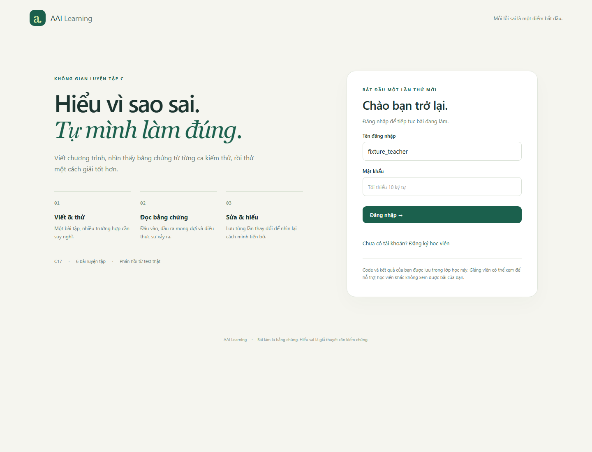
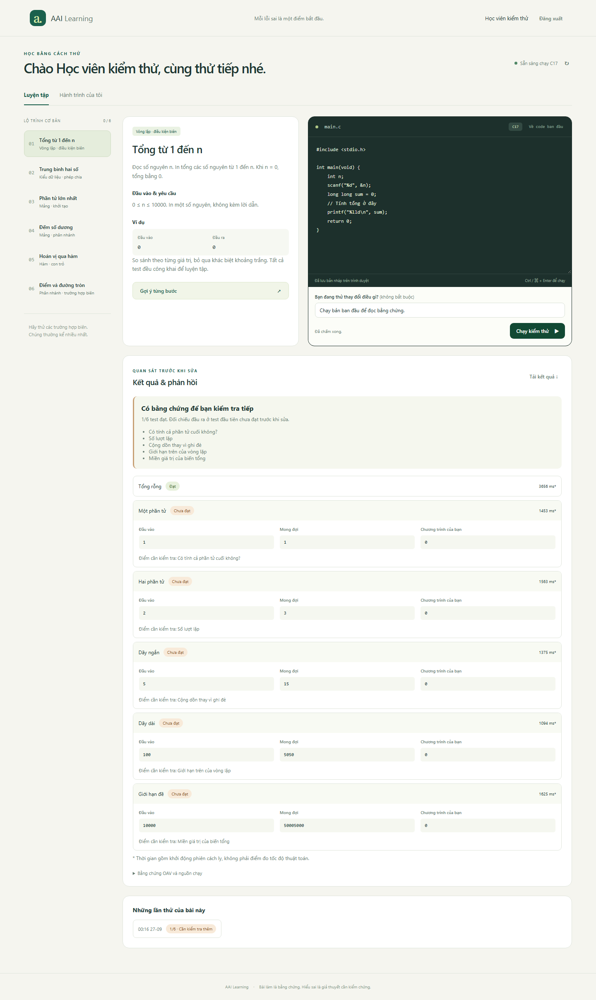
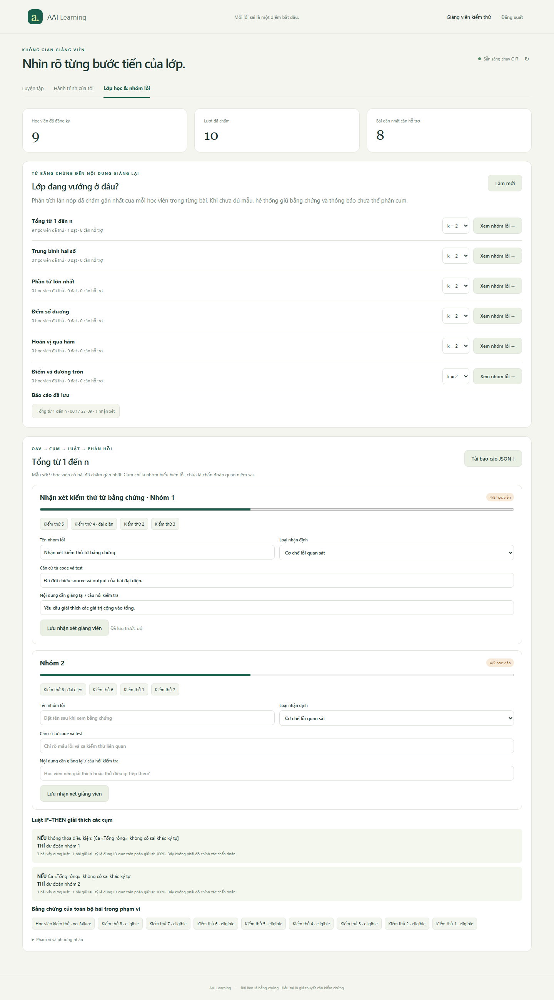
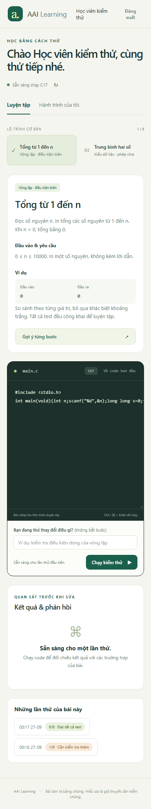

# Nghiệm thu AAI Learning — 27/09/2026

App thực hiện luồng học viên làm bài và giảng viên phân tích theo đề 5.
[Cài đặt và sử dụng](../../docs/learning_app.md),
[đối chiếu yêu cầu](../../docs/topic5-contract.md).

## Kết quả đã quan sát

- Bộ kiểm tra mặc định: 184 tests + 3 subtests đạt; Ruff đạt; 27/27 research smoke.
- Docker thật: 14 checks đạt, gồm 36 ca oracle của sáu lời giải do dự án viết,
  compile error, sai output, vòng lặp vô hạn, nonzero exit, giới hạn output,
  không network/non-root/root filesystem chỉ đọc và output sai UTF-8.
- Chromium thật, Docker thật: đăng ký giảng viên/học viên; code ban đầu đạt 1/6,
  sửa đạt 6/6; hai lần nộp lưu lịch sử; phiên còn sau reload; hai cụm và luật;
  mở bằng chứng source/test/OAV; lưu review và mở lại sau reload; mobile 390 px
  không tràn ngang. Không có JavaScript page error trong luồng này.

[Kết quả browser máy đọc được](acceptance.json),
[môi trường và fingerprints mã nguồn](verification.json).
13 ca Docker bị skip trong lệnh offline nhưng đã chạy trong nhóm Docker riêng.
Một kiểm tra cấu hình lệnh nằm ở cả hai suite; không cộng hai số thành tổng
tests độc lập. Screenshot và kết quả lấy từ lượt local
`artifacts/learning-browser-20260927-v3`; các lượt trước được giữ ở artifacts.

## Phạm vi bằng chứng

Toàn bộ tài khoản/code trong ảnh là **fixture do dự án tự viết**. Không phải
lớp học thực, không phải corpus C-Pack/ITSP, không phải expert gold. Bài sai →
sửa đúng chứng minh app chấm và lưu được lần sửa; không chứng minh người học
tiến bộ nhờ phương pháp. Fidelity của luật chỉ đo dự đoán ID cụm.
Database/token/phiên kiểm thử không được đưa vào repo.

Runner hiện là Docker Linux có hạn mức. Image ID cụ thể ở acceptance.json;
đổi máy hoặc build lại có thể đổi ID do package Debian tại thời điểm build.
App đang chạy local, chưa được triển khai Internet. Chưa có nghiên cứu trên
người hay kết quả SOTA mới từ phần app này.

## Ảnh từ kiểm thử thực tế

