**Đánh giá và định hướng nghiên cứu cho Đề 5: từ gom biểu hiện lỗi đến phân biệt cơ chế lỗi bằng bằng chứng thực thi**

Ngày chốt khảo sát: **26/09/2026**. Đối tượng: đề 5 ở trang 8, phần “Dữ liệu thầy đã có”, trong PDF người dùng cung cấp. Điều kiện thực tế dùng trong toàn bộ báo cáo: **không có dữ liệu do thầy cung cấp; không có lớp/hệ thống sinh viên riêng; tự tìm dữ liệu; thực nghiệm offline; GPU có thể dùng Kaggle hoặc thuê**.

**Khuyến nghị: chọn đề 5, nhưng nâng câu hỏi nghiên cứu.** Mục tiêu nên là phát hiện và gom nhóm **cơ chế lỗi có bằng chứng**, nhận biết các trường hợp chưa thể phân biệt, rồi đề xuất giả thuyết misconception với mức bằng chứng phù hợp. Đây là hướng có thể nhắm tới bài báo về phương pháp và benchmark. Một dashboard gắn LLM để đặt tên cụm, hoặc nối AST embedding với K-means, khó đủ mới ở thời điểm này.

Tên làm việc bằng tiếng Việt: **“Phân biệt và gom nhóm cơ chế lỗi trong bài lập trình bằng bằng chứng thực thi và sửa đổi kiểm chứng được.”**

Tên làm việc bằng tiếng Anh: **“When Failed Tests Are Not Enough: Evidence-Grounded Discovery of Programming Error Mechanisms.”**

Đây là quyết định nghiên cứu và thiết kế thực nghiệm, **chưa phải một phương pháp đã chứng minh vượt SOTA**. Không có leaderboard chung được xác minh cho đúng tổ hợp bài toán: code C thật, cơ chế lỗi đa nhãn, chuyển sang bài tập mới, có bằng chứng và được phép từ chối kết luận. Các con số từ những task khác không thể ghép thành một bảng xếp hạng chung.

**1. Cách khảo sát và phạm vi bằng chứng**

Đã dùng skill `agent-reach` để định tuyến đọc GitHub qua GitHub CLI, skill Exa Search cho khảo sát nhiều vòng và đọc nguồn gốc, skill PDF để trích nội dung và kiểm tra trực quan trang đề tài, cùng `karpathy-guidelines` cho phần audit mã nguồn. Tài liệu đính kèm và hướng dẫn trong repo được xem là đối tượng phân tích; yêu cầu thực tế của người dùng quyết định phạm vi công việc.

Khảo sát đi qua năm nhánh: nền tảng nhận thức/ngữ nghĩa; khai phá lỗi và misconception; kiểm chứng/sửa lỗi/sinh test; dữ liệu; mô hình nhỏ cho thực nghiệm. Các truy vấn Exa yêu cầu tổng cộng 132 lượt kết quả, có trùng và có kết quả bị loại; **không được diễn giải thành 132 bài đã đọc sâu**. Danh mục đi kèm ghi rõ nguồn nào đọc các phần của bài, nguồn nào mới có abstract, sách nào chỉ đọc chương/trang liên quan. Đây là khảo sát có mục tiêu, không phải systematic review theo PRISMA và không chứng minh bao phủ mọi công trình đến cutoff.

Repo được kiểm tra tại commit [`3c67734c25236b7fdcd9d84b8d4c2fa589add36e`](https://github.com/linhlinhlin/AAI/tree/3c67734c25236b7fdcd9d84b8d4c2fa589add36e), commit ngày 23/09/2026. Đã đọc README, hồ sơ nghiên cứu/bàn giao, `features.py`, các phần chính của `pipeline.py`, kết quả A/B/C, trạng thái annotation và hai mẫu code/log cụ thể. Audit mới **đọc lại các artifact đã lưu**, không huấn luyện mô hình, không chạy lại clustering và không thực thi code C. Không thay đổi repo của đồng đội.

**2. Vì sao chọn đề 5 trong danh sách?**

Tiêu chí ưu tiên là: có câu hỏi chưa giải quyết rõ; tự tìm được dữ liệu phù hợp; có thể phản bác giả thuyết bằng thực nghiệm; có đối chứng đủ mạnh; kết luận không phụ thuộc một lớp sinh viên chưa tồn tại. Độ phức tạp mô hình không phải tiêu chí đánh giá chất lượng nghiên cứu.

So sánh mười đề trong phần “Dữ liệu thầy đã có” là đánh giá phương pháp theo điều kiện của nhóm, không phải thang điểm định lượng đã được kiểm định:

| Đề | Khả năng nghiên cứu offline | Nút thắt chính | Khuyến nghị |
|---|---|---|---|
| 1. Coding dynamics, dự báo trượt môn | Có thể, nếu có lịch sử và outcome học phần thật | Điểm cuối kỳ, lịch học, sinh viên độc lập; dự báo từ một benchmark sửa lỗi không thay được nhãn trượt môn | Xếp sau đề 5 với dữ liệu hiện có |
| 2. Lỗi ngữ nghĩa + giải thích bằng GNN/LLM | Tốt, có code/test và benchmark sửa lỗi | “GNN + LLM” đã là ý tưởng quen thuộc; phải chứng minh localization và grounding của giải thích | Lựa chọn thứ hai; có thể cung cấp mô-đun cho đề 5 |
| 3. Đạo văn/AI-generated code | Làm benchmark được | Attribution nhạy với generator, prompt, biến đổi code và thay đổi phân phối; gần nhau về code không xác nhận gian lận | Không ưu tiên |
| 4. Khuyến nghị + RL | Offline được ở mức dự đoán hoặc mô phỏng | Không có tương tác can thiệp thì khó xác nhận chính sách giúp học tốt hơn; reward và simulator dễ tự củng cố giả định | Không chọn làm hướng chính |
| **5. Misconceptions clustering** | **Tốt cho khai phá cơ chế lỗi và benchmark bằng chứng** | Nhãn khái niệm, nhiều nguyên nhân cùng biểu hiện, suy diễn vượt bằng chứng | **Ưu tiên cao nhất** |
| 6. Memory bugs + logic | Tốt nếu có lỗi/replay phù hợp | Cần so với công cụ phân tích chương trình đã mạnh; chứng minh giá trị thêm của phương pháp | Phương án dự phòng nếu muốn trọng tâm formal methods |
| 7. Phân loại tối ưu hiệu năng | Có thể | Độ phức tạp không suy ra chỉ từ số vòng lặp; cần benchmark tài nguyên ổn định và định nghĩa nhãn | Khó tạo đóng góp nếu chỉ cây quyết định/Naïve Bayes |
| 8. Syntax repair | Tốt, có benchmark công khai | Lĩnh vực đã trưởng thành; compile được chưa đồng nghĩa giữ nguyên ý định | Không ưu tiên trừ khi có câu hỏi mới rất hẹp |
| 9. Concept tagging | Tốt | Presence của AST không đồng nghĩa sử dụng đúng hay đã làm chủ kỹ năng | Hợp làm auxiliary task/ontology cho đề 5 |
| 10. Bug-fixing trajectory + MDP | Có thể mô tả chuỗi | Mô hình hóa thành MDP chưa tạo ra đóng góp; optimality và metacognition cần bằng chứng riêng | Chỉ mở sau khi có lịch sử đủ tốt |

Mười đề ở phần đầu cũng không bị loại vì “khó”: đề 1/4/8/10 về tối ưu, định tuyến và thương thảo có thể nghiên cứu mô phỏng; đề 2 cần chuỗi giá cước có quyền sử dụng và backtest đúng thời gian; đề 3/7 cần dữ liệu ảnh/video đúng miền; đề 5 về pedagogical agent chịu hạn chế đánh giá học tập; đề 6 về chấm code cạnh tranh với hệ thống execution-grounded; đề 9 y tế đòi hỏi kiểm chứng chuyên môn mạnh hơn. Với nền tảng nhóm đã có và các bộ C công khai, chuyển sang chúng hiện chưa cho lợi thế rõ hơn đề 5. Đây là sàng lọc về thiết kế nghiên cứu, không phải một khảo sát SOTA riêng cho từng lĩnh vực.

**3. Repo đang ở đâu, và kết quả nào thực sự có ý nghĩa?**

Điểm mạnh của repo là lưu nguồn gốc dữ liệu, giữ `student_id=null` khi thiếu, tách AI review khỏi nhãn người thật, chia cohort theo bài/test suite, có baseline chữ ký test và surrogate rule. Những nền tảng này nên giữ. [Hồ sơ bàn giao tại snapshot](https://github.com/linhlinhlin/AAI/blob/3c67734c25236b7fdcd9d84b8d4c2fa589add36e/misconceptions-prototype/docs/itsp_handoff_2026-09-20.md).

Theo hồ sơ repo, importer đã xử lý nguồn ITSP gồm 661 bài sai ở 74 bài tập, nhập 649, có 648 eligible và một parser failure; 12 mẫu bị loại do test không khớp. Các số này là **số repo báo cáo**, không phải số tôi tự chạy lại importer. Thí nghiệm A/B/C chính chỉ dùng 59 submissions ở ba bài. Con số test phần mềm pass trong tài liệu không được dùng làm bằng chứng chất lượng khoa học.

Audit độc lập các file seed 42 cho kết quả:

| Bài ITSP | Submissions | OAV kết hợp khác nhau | Cặp có OAV giống hệt / mọi cặp cùng bài | Phân hoạch A và C, gộp train + holdout |
|---|---:|---:|---:|---|
| 2812 | 19 | 9 | 31 / 171 | Giống nhau |
| 2825 | 22 | 8 | 43 / 231 | Giống nhau |
| 2833 | 18 | 10 | 16 / 153 | Giống nhau |
| Tổng trong từng bài | **59** | **27** | **90 / 555 = 16,22%** | Giống nhau ở cả ba bài |

A = test-only; C = test 0,8 + cấu trúc 0,2. Đây là so sánh các tập thành viên của cụm, không phụ thuộc tên số của cluster. 27 là tổng số signature trong từng bài, không phải 27 misconception. 16,22% là tỷ lệ cặp không phân biệt được bởi biểu diễn hiện tại, **không phải tỷ lệ phân cụm sai**: nhiều cặp có thể thực sự cùng cơ chế.

Hai ca trong bài 2825 cho thấy mất thông tin cụ thể:

| Submission | Expected ở test 1 | Output đã log | Cơ chế quan sát được |
|---|---|---|---|
| `271173_buggy` | `Point is outside the Circle.` | `Point is outside the Cicle.` | Chuỗi in ở nhánh ngoài viết sai chính tả |
| `271188_buggy` | `Point is outside the Circle.` | `Point is on the Circle.` | Nhánh ngoài in nhãn của trường hợp nằm trên đường tròn |

Hai bài cùng vector pass/fail và cùng OAV kết hợp trong thí nghiệm. Mã nguồn và log phân biệt được lỗi, còn vector hiện tại thì không. **Đầu ra thực tế đã có trong dữ liệu nhưng chưa đi vào biểu diễn clustering.** Vì vậy một mô hình mới chỉ thắng pass/fail bằng cách đọc stdout chưa đủ để chứng minh đóng góp mạnh; phải có baseline stdout-difference và các đặc trưng quan hệ đơn giản.

Trạng thái trong JSON expert validation là 17 ca ứng viên, 0 lượt chấm độc lập hoàn tất, 0 adjudication, codebook chưa ready, purity `null`. Không chuyển AI review thành gold. Các cờ C hiện tại chủ yếu cho biết một cấu trúc có xuất hiện; chúng chưa mã hóa đầy đủ nhánh nào in gì, biến nào điều khiển vòng lặp, hay cập nhật có đi về điều kiện dừng không. [Mã trích đặc trưng](https://github.com/linhlinhlin/AAI/blob/3c67734c25236b7fdcd9d84b8d4c2fa589add36e/misconceptions-prototype/src/misconceptions/features.py).

Kết luận đúng từ audit: nền tảng kỹ thuật đã có, nhưng chưa có bằng chứng rằng biểu diễn cấu trúc hiện tại giúp gom **cơ chế lỗi** tốt hơn, càng chưa xác nhận trạng thái nhận thức. 59 bài đã được xem và dùng phản biện phải nằm ở tập phát triển. Tôi không đề nghị lấy chúng làm test độc lập của phương pháp mới.

**4. Công trình trước đã làm đến đâu?**

| Công trình/nhóm | Điều đã có | Hệ quả đối với đề tài |
|---|---|---|
| [Shi et al., LAK 2021 — NC State](https://isnap.csc.ncsu.edu/home/public/papers/ShiLAK2021.pdf) | Học code embedding để gom bài sai và hỗ trợ chuyên gia tìm misconception theo bài | Code embedding + clustering không phải đóng góp mới tự thân |
| [SMoL Tutor, OOPSLA 2024 — Brown](https://cs.brown.edu/people/sk/Publications/Papers/Published/lk-smol-tutor/paper.pdf) | Taxonomy, câu hỏi dự đoán hành vi và các interpreter biểu diễn hiểu sai; nghiên cứu với người học | Cơ sở để định nghĩa giả thuyết theo ngữ nghĩa; không suy rằng chỉ đọc bài code cũng đạt cùng mức chứng cứ |
| [Conceptual Mutation Testing, Programming vol. 8, 2024 — Brown](https://programming-journal.org/2024/8/7/) | Gom ví dụ/test sai của sinh viên rồi xây mutant theo sai hiểu đặc tả | Conceptual mutant đã có; input là ví dụ do người học viết, không đồng nhất bài code sai |
| [SANN logical-error analysis, EDM 2025 — NC State/UC Berkeley](https://educationaldatamining.org/edm2025/proceedings/2025.EDM.long-papers.85/index.html) | Mô hình correctness với attention trên subtree, phân tích lỗi có expert annotation | Attention chỉ là tín hiệu liên quan; cần đối chứng kiểm chứng thay vì coi attention là nguyên nhân |
| [Code-edit embeddings, AIED 2025 — UMass Amherst](https://arxiv.org/html/2502.19407) | CodeT5, contrastive loss dựa trên test masks, biểu diễn chỉnh sửa và phân cụm debugging | “Học embedding của bản sai–bản sửa” đã có; cần đóng góp vượt mục tiêu reconstruction/hint |
| [InvAASTCluster, JSS 2025 — INESC-ID/IST/CTU](https://pmorvalho.github.io/publications/jss2025/) | Kết hợp invariant động với AAST, clustering và repair | Bắt buộc đối chiếu khi tuyên bố tận dụng ngữ nghĩa thực thi; mục tiêu của họ không trực tiếp là latent misconception |
| [McMining, EACL 2026 — UNC Charlotte](https://aclanthology.org/2026.eacl-short.10/) | Phát hiện và diễn đạt misconception từ một hoặc nhiều problem-code pairs; benchmark và baseline LLM | Prior work trực tiếp nhất; không thể tuyên bố lần đầu dùng LLM khai phá misconception từ code |
| [Pattern-based KC Extraction, EDM 2026](https://educationaldatamining.org/edm2026/proceedings/2026.EDM.full-papers.251/index.html) | SANN → subtree → VAE → K-means → knowledge tracing, có expert evaluation | Chỉ thêm AST/VAE/clustering đã quá gần; KC và misconception phải được phân biệt |
| [AI-Augmented Instruction, SIGCSE TS 2026 — Georgia Tech, poster](https://sigcse2026.sigcse.org/details/sigcse-ts-2026-posters/160/AI-Augmented-Instruction-Real-Time-Misconception-Detection) | LLM + sentence encoder + K-means + dashboard cấp lớp; abstract nói pilot đang tiến hành | Dashboard tương tự không đủ làm novelty; poster không là bằng chứng hoàn tất learning-effect study |
| [MENTOR, JSS 2026](https://pmorvalho.github.io/publications/jss2026/) | Program clustering, GNN alignment, MaxSAT localization, LLM và vòng CEGIS để sửa C | GNN + LLM + execution/repair cũng đã có; cần đổi mục tiêu khoa học sang khả năng phân biệt cơ chế và giới hạn kết luận |
| [Expert-Refined Misconception Signals, UKICER, 02/09/2026](https://dl.acm.org/doi/10.1145/3830800.3830801) | So sánh correctness/process/misconception signals và đánh giá với chuyên gia trên CodeWorkout | Bài rất mới, phải đưa vào related work; số plausibility/actionability trong abstract không là gold về niềm tin của sinh viên |

**McMining cần đọc đúng phiên bản.** Bản EACL chính thức có 67 misconception, 1.675 code samples, 339 bags; benchmark dùng McInject để chèn misconception, không phải 339 sinh viên thật. Table 2 của bản chính thức báo accuracy tốt nhất của McMiner-M là **81,4%**, F1 **80,5%**, đánh giá bằng GPT-5 judge; bản arXiv v1 có số khác. Table 3 có Qwen-3-8B/14B, nên đã có baseline mở để tái lập. Ngôn ngữ là Python và dữ liệu chủ yếu có một misconception chính; điều này giới hạn chuyển kết luận sang C thật đa lỗi. [Bản PDF xuất bản, Tables 1–3 và Limitations](https://aclanthology.org/2026.eacl-short.10.pdf).

Một số số liệu chi tiết theo loại bag trong main text và appendix của McMining chưa hoàn toàn nhất quán; không dùng chúng làm mốc định lượng trong thiết kế này. Khi tái lập cần lấy prediction/judge records và thống nhất metric. Quan trọng hơn, “phát hiện đúng mô tả được chèn” khác “xác nhận người học thực sự tin điều đó”.

Hai preprint tháng 9 đáng dùng để thiết kế kiểm tra phụ, chưa dùng làm kết quả đã ổn định: [Better Understanding, Better Fixes?, 04/09/2026](https://arxiv.org/abs/2609.04909) phân tích hallucination cả ở artifact trung gian của repair; [On the Lexical Superstition…, 22/09/2026](https://arxiv.org/abs/2609.26388) nghiên cứu tác động của tên biến lên code comprehension. Chúng gợi ý cần kiểm tra bằng chứng thực thi và robustness khi đổi tên, không chứng minh phương pháp đề xuất ở đây sẽ thành công.

**Những phần không được nhận là novelty riêng:** active testing đã có [ATAS, AIED 2018](https://arxiv.org/html/1804.05655); sinh test chẩn đoán/localization và clustering đã có [LEGenT, Learning @ Scale 2022](https://dl.acm.org/doi/10.1145/3491140.3528282); conceptual mutants, contrastive edit embeddings, invariant clustering và CEGIS repair đều đã có. Khoảng trống đang đề xuất là **đánh giá và cải thiện khả năng nhận dạng cơ chế dưới bằng chứng thiếu, cùng việc không gán một nguyên nhân chắc chắn khi có nhiều giải thích tương thích**, trên dữ liệu thật và split khó. Đây là novelty hypothesis cần kiểm tra tiếp, không phải tuyên bố “đầu tiên”.

**5. Nền tảng từ sách: đưa vào phương pháp như thế nào?**

Đã đọc các trang liên quan của [PLAI, bản 3.2.5, Shriram Krishnamurthi](https://www.plai.org/3/5/plai-v325.pdf): evaluation trên giấy, binding/static scope, và phần làm bộ nhớ tường minh. Điểm áp dụng là phải biểu diễn chính xác thứ tự đánh giá, binding, giá trị và địa chỉ; sự xuất hiện của một node AST không chứa đủ thông tin đó. Không dùng mô hình SMoL thay ngữ nghĩa C: SMoL giúp xây cách tư duy; runner và analyzer vẫn phải theo dialect/compiler C đã chốt.

Đã đọc phần công khai của [The Programmer’s Brain, chương 7 — “Misconceptions: Bugs in thinking”](https://livebook.manning.com/book/the-programmers-brain/chapter-7/). Chương này phân biệt lỗi do sơ suất với lỗi do cách hiểu. Bài học thiết kế là phải giữ giả thuyết cạnh tranh về nguồn gốc một lỗi; không để phần sinh tiếng Việt tự biến “code đang làm X” thành “người học tin X”. Phần đã đọc là excerpt công khai, không phải toàn bộ sách.

Tôi ưu tiên nền tảng này hơn gắn thật nhiều model mới vì nó quyết định **nhãn nào có nghĩa và phép đo nào có giá trị**. Mô hình mạnh không sửa được một ground truth được định nghĩa sai.

**6. Phát biểu bài toán nghiên cứu đề nghị**

Ba tầng cần tách:

| Tầng | Ví dụ kết luận | Loại bằng chứng |
|---|---|---|
| Hiện tượng | Test biên cuối trả sai; stdout thiếu ký tự | Log hoặc execution |
| Cơ chế trong chương trình | Điều kiện vòng lặp loại phần tử cuối; nhánh ngoài in chuỗi nhãn sai | Quan hệ cấu trúc + trace + can thiệp sửa có kiểm tra |
| Quan niệm của người học | Người học tin điều kiện `< n` bao gồm chỉ số `n` | Rationale/tracing response hoặc chuỗi hành vi độc lập phù hợp; code đơn lẻ chưa đủ |

Đích chính là tầng hai. Đích phụ là đề xuất **potential misconception** với evidence và alternatives; không tuyên bố biết tâm trí người viết. Một submission có thể nhiều lỗi. Một bug có thể do sơ suất hoặc nhiều niềm tin khác nhau. Code pass test cũng không bảo đảm người học không có hiểu sai; chỉ là “không quan sát lỗi theo suite này”.

Đầu vào: đề bài, source hiện tại, test contract, log/runner; nếu nguồn cho phép thì thêm lịch sử **trước hoặc tại** thời điểm dự đoán. Đầu ra: nhóm cơ chế lỗi, span/vết thực thi hỗ trợ, tập giả thuyết còn phù hợp, phản ví dụ phân biệt nếu tìm được, hoặc trạng thái chưa phân biệt được. Tránh bắt mọi bài vào đúng một cluster có nhãn chắc chắn.

**RQ1.** Biểu diễn pass/fail, stdout, cấu trúc quan hệ, trace và sửa đổi kiểm chứng được làm thay đổi mức phân biệt cơ chế lỗi như thế nào?

**RQ2.** Với cùng ngân sách execution và model calls, chọn test/can thiệp có mục tiêu có giảm gộp sai các cơ chế hơn test ngẫu nhiên và edge-case heuristics không?

**RQ3.** Mô hình được học từ bằng chứng có tổng quát sang bài chưa thấy, người học chưa thấy và nguồn dữ liệu khác tốt hơn code-only/LLM-only không?

**RQ4.** Cho phép trả tập giả thuyết hoặc abstain có giảm kết luận sai ở cùng coverage, đặc biệt trên ca typo, spec mismatch, đa lỗi, undefined behavior và cơ chế chưa thấy không?

Một nhận xét toán học hữu ích nhưng không mới: nếu biểu diễn E cho E(p₁)=E(p₂), mọi classifier xác định chỉ đọc E buộc cho cùng đầu ra. Nếu nhãn cơ chế khác nhau thì không thể đúng cả hai. Với nhãn đơn và các bucket b có cùng E, upper bound accuracy thực nghiệm là `Σ_b max_y n(b,y) / N`. Muốn tính bound phải có nhãn độc lập; audit hiện tại chưa có. Đây là lý do nghiên cứu thêm thông tin, không chỉ đổi thuật toán clustering.

Còn có bất định không thể giải bằng chạy thêm test: hai người có thể viết cùng code từ hai cách hiểu khác nhau. Execution của code không phân biệt được trạng thái nhận thức đó. Hệ thống cần nhận ra giới hạn này thay vì dùng confidence cao để che giấu.

**7. Phương pháp chính: tăng bằng chứng rồi học biểu diễn cơ chế**

```mermaid
flowchart LR
    A[Code, đề bài, test contract] --> B[Log và quan hệ cấu trúc]
    B --> C[Các giả thuyết cơ chế lỗi]
    C --> D[Test và sửa đổi có mục tiêu]
    D --> E[Runner và kiểm tra oracle]
    E --> F[Loại giả thuyết bị phản bác]
    F --> G[Biểu diễn bằng chứng]
    G --> H[Nhóm cơ chế và mẫu đại diện]
    H --> I[Tập giả thuyết hoặc abstain]
```



**7.1. Biểu diễn không làm mất thông tin sẵn có.** Giữ pass/fail, expected/actual output, exception/status, loại sai khác về số/chuỗi/độ dài và vùng input. Feature cấu trúc tiến từ “có if” sang quan hệ như “cùng chuỗi được in ở hai nhánh có điều kiện đối nghịch”, “biến được so sánh là biến được cập nhật”, “dấu cập nhật đi về/ra xa điều kiện dừng”. Feature phải kèm span, trạng thái unknown và applicability; không coi analyzer không hiểu là false.

Không bỏ literal/toán tử một cách đại trà khi chuẩn hóa AST: đổi 0 thành 1, `<` thành `<=`, hoặc chuỗi nhãn làm thay đổi lỗi. Tên biến có thể chuẩn hóa bằng binding-aware renaming; phép biến đổi phải được kiểm tra bảo toàn hành vi trong miền được thử.

**7.2. Tập giả thuyết và kiểm chứng.** LLM nhỏ hoặc bộ pattern đề nghị một số cơ chế cùng evidence span và một sửa đổi cục bộ. Cho mỗi sửa đổi: kiểm tra compile, test gốc, test phát triển bổ sung hợp lệ, trạng thái sanitizer và mức độ rewrite. Lưu cả những sửa đổi thất bại. Một patch vượt test là một giả thuyết sửa được quan sát hỗ trợ, không phải bằng chứng duy nhất về nguyên nhân và không xác nhận niềm tin của người học.

Khi dùng bản correct tương lai của cùng người học, chỉ được dùng ở **nhánh retrospective** hoặc để xây nhãn offline; không đưa nó vào input của nhánh dự đoán tại thời điểm submission sai. Nhánh online-like phải tự sinh candidate patch hoặc truy hồi từ tập train được cho phép. Hai chế độ phải báo riêng.

**7.3. Chọn phép thử phân biệt.** Với một tập giả thuyết H về **cơ chế chương trình**, tạo input hợp lệ nơi dự đoán của chúng khác nhau. Chọn test tối đa hóa mức chia tách giả thuyết dưới ngân sách; nếu dùng entropy, trọng số trên H ban đầu là phân phối do mô hình ước lượng, không phải posterior nhận thức đã được xác thực. Có thể dùng disagreement score không xác suất làm baseline.

Luôn so sánh với random test và heuristic boundary test cùng số lần chạy. LLM đề xuất input; reference đã kiểm tra quyết định expected output. Test chưa đáp ứng precondition hoặc oracle mâu thuẫn phải bị loại. Không chọn test bằng cách xem nhãn cuối. Khi output không phân biệt được, cân nhắc trace/control-flow evidence hoặc can thiệp cục bộ; nếu vẫn thiếu thông tin, giữ nhiều giả thuyết.

Trường hợp OAV `Cicle`/`on` ở repo không cần active test mới: đọc stdout hiện có đã đủ. Ca này thuộc phép kiểm tra baseline. Bộ challenge phải có thêm ca mà **cả stdout ban đầu cũng chưa đủ** thì mới đánh giá đúng phần active evidence.

**7.4. Học biểu diễn.** Hướng neural có giá trị là encoder học từ code có đánh dấu span, test/trace và kết quả can thiệp. Positive pair là cùng cơ chế đã được nhãn/kiểm chứng hỗ trợ qua các cách viết hoặc bài khác nhau. Hard negative là cùng signature/solution strategy nhưng cơ chế khác. Unknown pair không ép thành negative. Sử dụng metric learning hoặc contrastive objective, rồi clustering/retrieval trên không gian đã học.

Không lấy “cùng template patch” làm gold same-misconception; đó chỉ là weak signal. Các biến thể cùng source, cùng patch generator và cùng semantic mutation phải nằm cùng split. Ablation code-only, evidence-only, frozen encoder và encoder có học là bắt buộc. Nếu chỉ biểu diễn stdout + quan hệ tĩnh đã đạt tương đương, kết luận chính sẽ là giá trị của bằng chứng/benchmark; không bịa lợi ích cho neural module.

Để chuyển giữa bài tập, không nối trực tiếp cột `test:1` của bài A với `test:1` của bài B. Mỗi quan sát phải mang ngữ cảnh đề/input/expected/actual; phần dùng chung là quan hệ ngữ nghĩa như “bỏ biên cuối”, “điều kiện lọc bị dùng làm điều kiện kết thúc”, hoặc “nhãn output không khớp nhánh”. Encoder có thể pool tập quan sát có mask cùng code slice theo ngữ cảnh. Nhãn cơ chế vẫn phải kiểm tra độc lập; tên quan hệ do LLM sinh không tự thành ground truth.

**7.5. Nhóm và giải thích.** Thử clustering có noise/outlier hoặc graph grouping cho phần có đủ similarity; báo rõ tính bắc cầu có thể sai trong multi-error. Với nhãn đa cơ chế, ưu tiên pairwise retrieval/overlapping memberships thay vì ép một partition. LLM diễn đạt kết luận từ record đã kiểm chứng, phải trỏ tới test/span/patch tương ứng. Cây luật chỉ mô tả phân hoạch; fidelity cao không là correctness của chẩn đoán.

**7.6. Confidence và abstention.** Dùng validation set riêng để chọn ngưỡng chấp nhận. Đánh giá risk–coverage; không lấy câu “tôi chắc 95%” của LLM làm calibration. Nếu thử conformal set prediction, chỉ nêu bảo đảm dưới các giả định thích hợp của calibration/test và nhãn; không mang bảo đảm đó sang dataset shift chưa kiểm tra. Bước đầu có thể dùng score kiểm chứng + calibration thực nghiệm mà không nhận bảo đảm hình thức quá mức.

Tách các trạng thái đầu ra: nhiều cơ chế cùng được hỗ trợ; chưa đủ bằng chứng phân biệt; cơ chế ngoài taxonomy; oracle mâu thuẫn; execution không hỗ trợ; và chưa quan sát cơ chế mục tiêu. “Unknown” không phải một cluster nguyên nhân chung. Với tập giả thuyết H và phép thử q, một acquisition rule để thử là `IG(q) = H(H|E) − E_o[H(H|E,q,o)]`, chia cho chi phí thực thi ước lượng. Đây là sử dụng nguyên lý information gain đã biết; novelty không nằm ở công thức. Với hypotheses/prior không đáng tin, disagreement và random-probe baselines giúp kiểm tra liệu việc ước lượng IG có thật sự đem lại lợi ích.

Đóng góp có thể đăng bài nằm ở ba phần gắn nhau: benchmark cô lập ca không phân biệt được; phương pháp chọn/học từ bằng chứng để phá sự nhập nhằng; và đánh giá cơ chế/uncertainty ngoài bài đã thấy. Không cần đưa toàn bộ GNN, RL, multi-agent và RAG vào cùng một pipeline để làm nó “nghiên cứu hơn”.

**8. Dữ liệu: kế hoạch tự chủ, không chờ thầy**

**Nguồn chính: C-Pack-IPAs 2026.** Release [`C-Pack-IPAs-26`](https://github.com/pmorvalho/C-Pack-IPAs/releases/tag/C-Pack-IPAs-26) được GitHub ghi ngày **31/05/2026**, commit `76901e1223b250a093a02d5e29113ad735c3d2b9`. Audit Git tree đầy đủ, không bị truncate, đếm riêng thư mục `all_submissions`:

| Chỉ số inventory | Số đã kiểm tra |
|---|---:|
| File `.c` trong `all_submissions` | **8.607** |
| Git blob code khác nhau theo byte | **8.343** |
| Token ID `stu_*` khác nhau trong đường dẫn | **246** |
| Bài theo cặp lab/exercise | **25** |
| Thư mục năm | **6** |
| Input test / output test trong `tests` | **106 / 106** |

Đây là inventory metadata, chưa phải số mẫu đủ điều kiện sau parser/replay/annotation. 246 là số ID được đếm; README tác giả nói ID nhất quán giữa bài và năm. Không cộng các thư mục correct/incorrect vào `all_submissions`: các thư mục dẫn xuất có bản trùng và bản `_fixed.c`. Cũng không gọi 8.343 source khác byte là 8.343 chương trình khác ngữ nghĩa. [Nguồn tại tag đã chốt](https://github.com/pmorvalho/C-Pack-IPAs/tree/C-Pack-IPAs-26).

Repo có đề bài, reference implementations, test input/output, lịch sử theo `sub_*`, một số log/output và MIT license; tác giả nêu đã lấy đồng ý dùng code cho mục đích học thuật. Cần audit chính xác timestamp/order, comparators, coverage log, compiler/dialect và near-duplicates khi nhập. Sáu thư mục `year-*` không tự động cung cấp sáu nhãn năm dương lịch. Suite 106 input cho 25 bài cũng chưa bảo đảm bao phủ cơ chế chẩn đoán cần nghiên cứu.

**ITSP: nguồn bổ sung và external check.** Giữ dữ liệu thật đang có trong repo. Những bài đã xem là development. Có thể chọn các bài còn lại theo protocol trước khi phân tích, nhưng test transfer chính nên độc lập với các ca dùng để thiết kế pattern. ITSP thiếu ID xuyên bài trong adapter hiện tại, nên không báo unseen-student performance ở nguồn này. [ITSP gốc](https://github.com/jyi/ITSP).

**McMining: benchmark tái lập bên cạnh.** Dùng bản Python nguyên gốc để tái lập method/prompt và so metric cùng protocol. Nếu tự dịch sang C, tạo một benchmark mới với provenance và validity checks; không giữ tên/số liệu cũ như thể tương đương. Dữ liệu inject thích hợp cho kiểm tra có kiểm soát, không thay external validation trên code người thật. [Repo McMiner](https://github.com/taisazero/mcminer).

**CodeInsight: bổ sung có điều kiện, không nằm trên đường hoàn thành bắt buộc.** Preprint [01/09/2026](https://arxiv.org/html/2609.00940v1) mô tả hơn 3 triệu submissions C++, 3.286 người học, 394 bài và outcomes từng test; liên quan Stanford/NUS và dữ liệu Việt Nam. Nhưng [dataset card hiện truy cập](https://huggingface.co/datasets/CodeInsightTeam/code_insights_csv) mô tả 781 sinh viên, 396 câu và yêu cầu chấp nhận điều kiện truy cập. Hai mô tả chưa đồng nhất; phải làm rõ phiên bản/phạm vi và license trước khi dùng. Không giả định đã tải được hay bộ này có nhãn misconception.

CodeNet/DeepFix có ích cho pretraining hoặc kiểm tra phụ, nhưng quy mô lớn hay nhãn compile/correctness không tự tạo gold về nhận thức. Không chọn dataset chỉ vì dung lượng lớn.

**Dữ liệu mới mà nhóm có thể đóng góp:** một tập annotation cơ chế trên C-Pack/ITSP, kèm testcase witness, span, patch candidates, mức chắc chắn và alternatives. Đề xuất ban đầu 400–800 submissions trải nhiều bài cho vòng đánh giá nghiêm túc, nhưng đây là **kế hoạch**, không phải con số đủ statistical power đã chứng minh. Sau pilot cần ước lượng tần suất lớp, độ phụ thuộc và độ rộng khoảng tin cậy để chốt cỡ mẫu. Phân tầng theo bài/loại lỗi và giữ trọng số lấy mẫu nếu muốn suy tỷ lệ toàn nguồn.

Không cần tuyển một lớp sinh viên để làm tập cơ chế. Tuy nhiên nhãn “cơ chế” nên có hai người am hiểu C chấm độc lập và adjudication có dấu vết; người chấm không cần là học viên. Nếu chỉ nhóm tác giả chấm thì báo đúng là author annotation. Không có người chấm thì vẫn nghiên cứu execution và synthetic mutations được, nhưng không được gọi kết quả là expert-validated hoặc nhận thức thật.

**9. Protocol thực nghiệm để tránh một kết quả đẹp nhưng rỗng**

**Tách dữ liệu trước mọi học và chọn feature.** Split theo người học, problem family, nhóm source trùng/near-duplicate và các bản trước–sau sửa. Khi nhiều quan hệ tạo thành connected component quá lớn, không âm thầm phá grouping: dùng các track riêng và báo phạm vi. Dự đoán ở thời điểm t không xem submission t+1. Prompt example, retrieval corpus, encoder fine-tuning, threshold và test-generation policy đều chỉ dùng train/dev được phép.

| Track | Giữ lại để kiểm tra | Có thể kết luận |
|---|---|---|
| T1: bài đã thấy, người mới | Student groups disjoint | Tổng quát sang người học mới trong miền bài quen thuộc |
| T2: bài mới | Problem families disjoint; kiểm thêm overlap người học | Transfer cơ chế giữa bài; không gọi unseen-student nếu người học vẫn overlap |
| T3: đồng thời người và bài mới | Chỉ các ô kiểm tra thỏa cả hai; báo dữ liệu bị loại | Transfer chặt hơn nếu đủ sample |
| T4: nguồn mới | Fit ở C-Pack, test ITSP chưa dùng phát triển, hoặc chiều ngược lại hợp lý | Dataset transfer trong phạm vi cơ chế và compiler được hỗ trợ |
| T5: cơ chế chưa thấy/đa lỗi | Giữ một số cơ chế và tổ hợp khỏi train | Open-set rejection và độ trung thực của tập giả thuyết |

Clustering transductive trên một cohort mới khác với classifier inductive. Nếu cho phép nhìn toàn cohort chưa gán nhãn, phải cho baseline quyền tương tự và báo là transductive; không trộn vào bảng inference từng submission.

**Baseline tối thiểu để bảo vệ bài:**

| Mã | Baseline | Vì sao cần |
|---|---|---|
| B0 | Exact pass/fail signature | Mức rẻ nhất của repo |
| B1 | Output-difference + status + feature quan hệ, clustering cố định | Kiểm xem lợi ích chỉ do giữ lại thông tin bị bỏ |
| B2 | Code embedding đóng băng + clustering/retrieval | Baseline neural có năng lực ngữ nghĩa, chi phí nhỏ |
| B3 | InvAASTCluster hoặc tái lập phần representation khả thi | Đối chứng program semantics; báo coverage và phần không tái lập |
| B4 | LLM code-only và LLM code+logs, cùng model/token budget | Tách lợi ích từ logs và từ vòng kiểm chứng |
| B5 | McMiner-S/M trên đúng task Python; bản adaptation C báo riêng | So với misconception mining trực tiếp |
| B6 | Edit embedding/repair-conditioned representation | So với idea đã có ở AIED 2025, tránh novelty giả |
| P | Phương pháp evidence + adaptive probes + learned representation | Đánh giá từng phần và tổng thể |

MENTOR/LEGenT có thể cung cấp module hoặc đối chứng patch/test generation; **repair rate của chúng không đặt cạnh misconception F1 của ta như cùng metric**. Nếu không chạy được một baseline, nói rõ lý do và giữ phần còn lại đủ mạnh, không gắn nhãn “so toàn bộ SOTA”.

**Metric chính:** pairwise precision/recall/F1 ở cơ chế, retrieval mAP/Recall@k phù hợp, macro-F1 cho phần có taxonomy; separate closed-set và open-set. Khi nhãn đa lỗi, định nghĩa trước positive pair là chung ít nhất một cơ chế hay cùng toàn bộ tập cơ chế; báo hai cách nếu cần, không đổi định nghĩa sau khi thấy kết quả.

**Metric uncertainty/evidence:** risk–coverage/AURC, coverage ở mức risk đã chốt trên dev, độ bao phủ nhãn đúng của tập giả thuyết và kích thước tập; tỷ lệ witness/test hợp lệ; tỷ lệ claim bị thực thi phản bác; regression của patch trên hidden validation suite; false-positive trên các đối chứng không có cơ chế mục tiêu. Không đồng nhất “pass hết suite” với “không có misconception”.

**Metric bổ sung:** ARI/NMI chỉ khi gold thật sự là một partition; silhouette và surrogate fidelity là chẩn đoán hình học, không quyết định thành bại khoa học. Báo eligibility/abstention/timeout để tránh đẹp số bằng loại bài khó. Báo per-problem, per-mechanism, nhiều nguồn và compute/time. Không so silhouette giữa hai không gian feature như bằng chứng cùng một mục tiêu giáo dục.

**Ablation tối thiểu:** không stdout; không cấu trúc quan hệ; không trace/patch evidence; random probes thay adaptive; bỏ hard negatives; encoder frozen thay fine-tuned; không abstention. So active và random ở cùng ngân sách. Kiểm đổi tên biến, đổi cách viết vòng lặp được kiểm tra tương đương, đảo thứ tự ứng viên và một số specs có ambiguity thật. Các mẫu tạo từ cùng nguồn luôn đi cùng split.

**Thống kê:** báo effect size và khoảng tin cậy, paired comparison trên cùng mẫu. Nhiều cặp dùng chung submission không độc lập; bootstrap theo problem/student groups thích hợp hoặc báo các track riêng. Ba seed không phải ba quần thể độc lập. Không dùng các nhãn cuối để chọn k, encoder, prompt hoặc threshold. Với 25 bài, sai số giữa bài có thể lớn và phải hiện ra trong khoảng tin cậy.

**Hai test suite khác vai trò:** `T_probe` có thể được dùng để tạo bằng chứng lúc inference và được tính vào ngân sách; `T_eval` bị giấu khỏi model/policy để kiểm tra patch/witness và hậu quả ngoài probes. Nếu đưa expected output của `T_eval` vào prompt rồi đo trên nó, đánh giá không còn độc lập.

**10. GPU và mô hình: tham vọng nằm ở phép thử, không ở số tham số**

Chọn C-Pack cỡ này không cần pretrain foundation model. Lộ trình kỹ thuật đủ mạnh là cached embeddings, fine-tune encoder/adapter và chạy verifier trên CPU. [Qwen3-Embedding-0.6B](https://huggingface.co/Qwen/Qwen3-Embedding-0.6B) là baseline mở phù hợp để thử retrieval/clustering; model card hỗ trợ code retrieval và instruction-aware embeddings, nhưng không công bố thắng benchmark cơ chế lỗi của nhóm.

McMining dùng Qwen-3-8B/14B nên một bản 8B là mốc tái lập hữu ích. [Qwen3.5-4B](https://huggingface.co/Qwen/Qwen3.5-4B) là ứng viên nhỏ mới hơn đã kiểm tra model card; nên chạy text-only như generator/reranker ứng viên. Không gọi nó là SOTA của đề tài chỉ vì mới hơn. Model card của cả dòng có quảng bá nhiều kiến trúc; phải lấy cấu hình đúng checkpoint khi triển khai.

Trên accelerator VRAM khoảng 16 GB, bắt đầu inference/adapter 4-bit cho model 4B, context 2k–4k, microbatch 1, gradient accumulation và checkpointing khi cần; đây là **cấu hình thử**, chưa được benchmark trên Kaggle trong lượt này. 8B QLoRA phụ thuộc implementation, context và activation; không hứa chắc chạy được trên mọi máy. Hai GPU 16 GB không tự thành một GPU 32 GB. Với T4 cần kiểm khả năng dtype/kernel, không mặc định BF16 hay FlashAttention hoạt động. Quota và loại GPU phụ thuộc tài khoản, không chốt một số giờ miễn phí cố định.

Ngân sách nghiên cứu nên đo bằng số token sinh, số forward pass, số chương trình-test chạy và GPU-hours thực tế. Chạy pilot 100–200 mẫu để đo throughput/peak VRAM rồi ngoại suy, không bịa số giờ huấn luyện. Model thương mại có thể làm một đối chứng nhỏ nếu sau này được phép chi phí, nhưng không là điều kiện hoàn thành.

Phần execution cần môi trường cách ly, timeout/memory limit, không mạng, filesystem giới hạn, compiler version cố định; log sanitizer/UB được route riêng. Đây là điều kiện tái lập khi chạy code thu thập, không phải một tính năng web cần xây. Hiện chưa thực thi mã sinh viên trên máy người dùng.

**11. Lộ trình theo cổng bằng chứng, không theo demo**

| Cổng | Sản phẩm phải có | Điều kiện quyết định |
|---|---|---|
| G0 — Chốt nguồn và task | Snapshot C-Pack, data contract, taxonomy cơ chế ban đầu, định nghĩa abstain | Nguồn tự chủ, nhãn và đơn vị đánh giá rõ |
| G1 — Audit và replay | Manifest, duplicate graph, kiểm oracle/compiler, subset replay được | Báo coverage và disagreement với log; không âm thầm sửa lịch sử |
| G2 — Benchmark phát triển | Ca collision + controls + multi-error; nhãn độc lập theo protocol | Có bằng chứng baseline mạnh vẫn thất bại ở câu hỏi mục tiêu |
| G3 — Baseline mạnh | B0/B1/B2/B4, và prior method phù hợp | Nếu stdout/quan hệ tĩnh giải quyết gần hết, điều chỉnh claim trước khi thêm neural |
| G4 — Phương pháp | Adaptive evidence và learned mechanism representation | Cải thiện ở cùng budget; ablation xác nhận bộ phận có tác dụng |
| G5 — Test khóa | Unseen problem/student/dataset; calibration, intervals, error analysis | Lợi ích còn tồn tại ngoài development và không đổi bằng bỏ mẫu khó |
| G6 — Bài báo/artifact | Method, benchmark card, scripts, predictions, negative results, limitations | Người khác tái lập kết luận; không cần một hệ thống lớp học trực tiếp |

Các mốc cỡ mẫu/hiệu ứng nên đăng ký trước sau pilot. Ví dụ một target kỹ thuật để quyết định nội bộ có thể là giảm lỗi gộp cơ chế ở coverage cố định và giữ chi phí dưới ngân sách đã chốt; chưa gán một ngưỡng cải thiện tùy ý thành “chuẩn xuất bản”. Không có kết quả tích cực thì vẫn có thể viết một nghiên cứu benchmark/giới hạn nếu đủ mới và bằng chứng mạnh; không bảo đảm được nhận.

Ưu tiên sửa repo khi triển khai vòng tiếp theo: bỏ giả định chờ dữ liệu thầy trong tài liệu; thêm adapter C-Pack; khóa split/manifest; giữ `review` và `evidence` tách khỏi input được phép; thêm stdout baseline; thêm artifact trace/probe/patch; thêm metric pairwise và risk–coverage. Giữ giao diện web như công cụ xem kết quả đã có, không dành trọng tâm nghiên cứu cho UI.

**12. Bài báo sẽ nói điều gì và không nói điều gì?**

Luận điểm mong muốn, chỉ được khẳng định sau thực nghiệm: “Các biểu diễn phổ biến nhập nhằng giữa những cơ chế lỗi khác nhau. Bổ sung bằng chứng thực thi/can thiệp có mục tiêu và học biểu diễn theo cơ chế giúp giảm gộp sai, đồng thời nhận biết phần không đủ chứng cứ, trên bài tập và dữ liệu chưa thấy.”

Một abstract hiện tại chỉ nên ở thì đề xuất, không có kết quả giả: nghiên cứu giới hạn nhận dạng cơ chế lỗi từ bài lập trình; xây bộ đánh giá gồm bài thật và kiểm tra có kiểm soát; đề xuất hệ thống chọn bằng chứng và trả tập giả thuyết; đánh giá chất lượng nhóm, calibration và transfer theo ngân sách. Khi có số liệu mới viết câu kết quả.

Các claim không được suy từ nghiên cứu offline này: tăng điểm thi; giảm bỏ học; chẩn đoán chính xác niềm tin của từng sinh viên; thay thế giảng viên; learning gain; hoặc đạt SOTA toàn lĩnh vực. Chúng cần các phép thử khác. Với hướng method/benchmark và phân tích giáo dục đúng, EDM/AIED/LAK là những cộng đồng có prior work liên quan; nếu trọng tâm là kiểm chứng/localization thì cộng đồng program analysis/SE phù hợp hơn. Chọn venue sau khi thấy đóng góp thực nghiệm, không hứa bài Q1 hay hội nghị hạng cao.

**Quyết định cuối cùng:** tiếp tục đề 5. Tận dụng repo như nền tảng baseline và audit, chuyển nguồn chính sang C-Pack-IPAs 2026, giữ ITSP làm development/transfer, dùng McMining làm đối chứng riêng. Trọng tâm khoa học là **cơ chế lỗi nào có thể phân biệt từ bằng chứng nào**, rồi mới diễn giải sang misconception tiềm năng. Hướng này có thể thực hiện hoàn toàn offline, có chỗ cho học biểu diễn và mô hình mới, và có tiêu chí thất bại rõ ràng.

**Artifact và tái lập audit**

Trong thư mục cùng báo cáo có `kiem_tra_bang_chung.json`, `audit_evidence.py`, `nguon_nghien_cuu.csv` và `protocol_thuc_nghiem.json`. JSON audit chứa commit, SHA256 của các báo cáo đã đối chiếu, kết quả signature collision, hai log đối chứng và Git tree SHA của C-Pack. Protocol là đề xuất chưa chạy, không phải kết quả.

Để tái lập, checkout đúng commit AAI; tải Git trees C-Pack dưới đây qua `gh api`, rồi chạy Python audit với đường dẫn tương ứng. Cần Python chuẩn và Git; script audit không import mã của repo, không chạy C và không gọi model.

```powershell
gh repo clone linhlinhlin/AAI AAI-audit
git -C AAI-audit checkout 3c67734c25236b7fdcd9d84b8d4c2fa589add36e
gh api 'repos/pmorvalho/C-Pack-IPAs/git/trees/f41320e74cc54c2f43552cdc346f0781a313738b?recursive=1' | Set-Content -Encoding utf8 cpack-all.json
gh api 'repos/pmorvalho/C-Pack-IPAs/git/trees/e04d088f26a59d71123cd891fb4088fac298f50b?recursive=1' | Set-Content -Encoding utf8 cpack-tests.json
python audit_evidence.py --repo AAI-audit --cpack-tree cpack-all.json --cpack-tests cpack-tests.json --output audit-rerun.json
```

Trong lượt này đã hoàn tất khảo sát, audit artifact và thiết kế nghiên cứu. Chưa tạo nhãn chuyên gia, chưa nhập/replay toàn bộ C-Pack, chưa huấn luyện mô hình và chưa đo kết quả SOTA mới.
